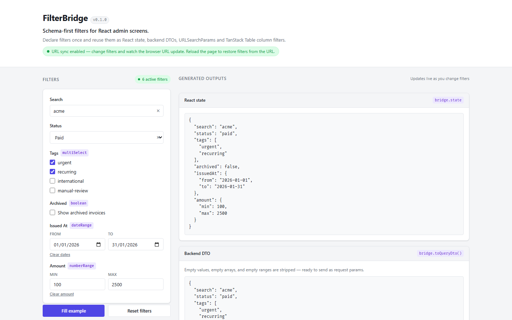

# FilterBridge

Schema-first filters for React admin screens.

Declare filters once as a typed schema. Reuse that definition as React state, URL search params, backend query DTOs, TanStack Table column filters, and Next.js App Router search params — without rewriting the same glue code across every project.

[](https://github.com/gabpaesschulz/filterbridge/actions/workflows/ci.yml)
[](https://www.npmjs.com/package/@filterbridge/core)
[](https://www.npmjs.com/package/@filterbridge/core)
[](./LICENSE)
[](https://www.typescriptlang.org/)
[](https://github.com/gabpaesschulz/filterbridge)

---

## Why FilterBridge?

Admin dashboards often define the same filter logic in multiple places:

```
UI state → URL search params → API query → table state → active filter chips
```

Each layer needs slightly different plumbing. You end up writing ad-hoc string parsing, inconsistent URL encoding, and fragile boolean/date/array coercion that diverges across projects.

### Without FilterBridge

You maintain parallel representations by hand:

```ts
// UI state
const [search, setSearch] = useState('')
const [status, setStatus] = useState<string[]>([])

// URL sync — manual, error-prone
const params = new URLSearchParams()
if (search) params.set('search', search)
if (status.length) params.set('status', status.join(','))

// Backend DTO — repeat the logic again
const dto = {
  ...(search && { search }),
  ...(status.length && { status }),
}
```

### With FilterBridge

Define your filters once and derive everything else:

```ts
const invoiceFilters = defineFilters({
  search: text(),
  status: multiSelect(['pending', 'paid', 'failed']),
})

const dto = toQueryDto(invoiceFilters, state)
const params = toSearchParams(invoiceFilters, state)
```

FilterBridge gives you one typed schema that drives consistent parsing, serialization, and DTO generation across all layers.

---

## Install

For core usage (schema, parsing, URL serialization, backend DTO):

```bash
npm install @filterbridge/core
```

With React state management:

```bash
npm install @filterbridge/core @filterbridge/react
```

With browser URL synchronization:

```bash
npm install @filterbridge/core @filterbridge/react @filterbridge/browser
```

With TanStack Table:

```bash
npm install @filterbridge/core @filterbridge/tanstack @tanstack/react-table
```

With Next.js App Router:

```bash
npm install @filterbridge/core @filterbridge/next
```

---

## Quick example

```ts
import {
  boolean,
  dateRange,
  defineFilters,
  multiSelect,
  numberRange,
  parseFilters,
  select,
  text,
  toQueryDto,
  toSearchParams,
} from '@filterbridge/core'

const invoiceFilters = defineFilters({
  search: text(),
  status: select(['draft', 'pending', 'paid', 'failed']),
  tags: multiSelect(['urgent', 'recurring', 'manual-review']),
  archived: boolean(),
  issuedAt: dateRange(),
  amount: numberRange(),
})

// Parse from URL (or any plain object with string values)
const state = parseFilters(invoiceFilters, {
  search: 'acme',
  status: 'paid',
  tags: 'urgent,recurring',
  archived: 'false',
  issuedAtFrom: '2026-01-01',
  issuedAtTo: '2026-01-31',
  amountMin: '100',
  amountMax: '2500',
})

// Backend DTO — undefined, empty arrays, and empty ranges removed
const dto = toQueryDto(invoiceFilters, state)
// {
//   search: 'acme',
//   status: 'paid',
//   tags: ['urgent', 'recurring'],
//   archived: false,
//   issuedAt: { from: '2026-01-01', to: '2026-01-31' },
//   amount: { min: 100, max: 2500 },
// }

// URL search params — deterministic serialization
const params = toSearchParams(invoiceFilters, state)
// search=acme&status=paid&tags=urgent%2Crecurring&archived=false&...
```

TypeScript infers the full state type from the schema, including literal union types:

```ts
import type { InferFilterState } from '@filterbridge/core'

type InvoiceFilterState = InferFilterState<typeof invoiceFilters>
// {
//   search?: string
//   status?: 'draft' | 'pending' | 'paid' | 'failed'
//   tags?: Array<'urgent' | 'recurring' | 'manual-review'>
//   archived?: boolean
//   issuedAt?: { from?: string; to?: string }
//   amount?: { min?: number; max?: number }
// }
```

---

## React example

```tsx
import { defineFilters, multiSelect, text } from '@filterbridge/core'
import { useFilterBridge } from '@filterbridge/react'

const filters = defineFilters({
  search: text(),
  status: multiSelect(['pending', 'paid', 'failed']),
})

export function InvoiceFilters() {
  const bridge = useFilterBridge(filters, {
    initialState: { search: 'acme' },
    onChange(state) {
      // called after every change — use this to trigger data fetching
      console.log(state)
    },
  })

  return (
    <form>
      <input
        value={bridge.state.search ?? ''}
        onChange={(e) => bridge.set('search', e.target.value)}
      />

      <button type="button" onClick={() => bridge.set('status', ['paid'])}>
        Paid only
      </button>

      <button type="button" onClick={() => bridge.clear('status')}>
        Clear status
      </button>

      <button type="button" onClick={() => bridge.reset()}>
        Reset all
      </button>

      {bridge.hasActiveFilters && (
        <span>{bridge.activeFilterCount} active filters</span>
      )}
    </form>
  )
}
```

`useFilterBridge` keeps state clean automatically: setting a filter to `''`, `[]`, or `{}` removes it instead of leaving empty values around.

---

## Demo



A local Vite + React app demonstrates all six filter types in a simulated invoice admin screen, with a live output panel showing React state, backend DTO, URL search params, and a filtered TanStack Table.

```bash
git clone https://github.com/gabpaesschulz/filterbridge.git
cd filterbridge
pnpm install
pnpm demo
```

Open [http://localhost:5173](http://localhost:5173).

[Open the live demo](https://filterbridge-demo.vercel.app) — or run it locally with `pnpm demo`.

---

## Packages

| Package | Description | npm |
|---------|-------------|-----|
| [`@filterbridge/core`](./packages/core) | Schema DSL, parsing, URL serialization, backend DTO | [](https://www.npmjs.com/package/@filterbridge/core) |
| [`@filterbridge/react`](./packages/react) | `useFilterBridge` React hook | [](https://www.npmjs.com/package/@filterbridge/react) |
| [`@filterbridge/browser`](./packages/browser) | Browser URL sync helpers | [](https://www.npmjs.com/package/@filterbridge/browser) |
| [`@filterbridge/tanstack`](./packages/tanstack) | TanStack Table adapter | [](https://www.npmjs.com/package/@filterbridge/tanstack) |
| [`@filterbridge/next`](./packages/next) | Next.js App Router adapter | [](https://www.npmjs.com/package/@filterbridge/next) |

All packages ship ESM and CJS with TypeScript declarations bundled.

---

## Core API

Full reference: [`docs/api/core.md`](./docs/api/core.md)

### Filter factories

| Factory | State type | URL format |
|---------|------------|------------|
| `text()` | `string \| undefined` | `search=invoice` |
| `select(options)` | `"opt1" \| "opt2" \| undefined` | `status=paid` |
| `multiSelect(options)` | `Array<"opt1" \| "opt2"> \| undefined` | `tags=urgent,review` |
| `boolean()` | `boolean \| undefined` | `active=true` |
| `dateRange()` | `{ from?: string; to?: string } \| undefined` | `createdAtFrom=…&createdAtTo=…` |
| `numberRange()` | `{ min?: number; max?: number } \| undefined` | `amountMin=…&amountMax=…` |

### Key functions

| Function | Description |
|----------|-------------|
| `defineFilters(schema)` | Creates a typed filter schema |
| `parseFilters(schema, input)` | Parses untrusted input into typed state |
| `toSearchParams(schema, state)` | Serializes state into `URLSearchParams` |
| `toQueryDto(schema, state)` | Converts state into a backend-friendly object |

---

## React API

Full reference: [`docs/api/react.md`](./docs/api/react.md)

### `useFilterBridge(schema, options?)`

| Return | Type | Description |
|--------|------|-------------|
| `state` | `InferFilterState<TSchema>` | Current filter state |
| `set(key, value)` | `void` | Update one filter |
| `setMany(values)` | `void` | Update multiple filters |
| `clear(key)` | `void` | Remove one filter |
| `reset()` | `void` | Clear all filters |
| `resetToInitial()` | `void` | Restore the `initialState` passed at mount |
| `hasActiveFilters` | `boolean` | Whether any filter is active |
| `activeFilterCount` | `number` | Count of active filters |
| `toQueryDto()` | object | Current state as backend DTO |
| `toSearchParams()` | `URLSearchParams` | Current state as URL params |

---

## Documentation

- [Core API reference](./docs/api/core.md)
- [React API reference](./docs/api/react.md)
- [Browser URL sync](./docs/api/browser.md)
- [TanStack Table adapter](./docs/api/tanstack.md)
- [Next.js App Router adapter](./docs/api/next.md)
- [Guides](./docs/guides/)
- [Architecture](./docs/concepts/architecture.md)
- [Why FilterBridge?](./docs/concepts/why-filterbridge.md)
- [Non-goals](./docs/concepts/non-goals.md)

---

## Why not just TanStack Table?

TanStack Table is a headless table engine with its own column filter model. FilterBridge is not a table engine — it focuses on a different problem: the filter *contract* around an admin list, how filters are parsed from a URL, how they become a backend query DTO, and how they stay typed throughout.

You can use both together. The `@filterbridge/tanstack` adapter converts between the two filter formats.

---

## Why not just nuqs?

nuqs is excellent at syncing React state with URL query strings. FilterBridge targets a narrower problem: admin list filters with typed schemas that carry semantic meaning — `select`, `multiSelect`, `dateRange`, `numberRange` — that drive consistent parsing, serialization, and DTO behavior.

---

## Non-goals

FilterBridge is not and will not become:

- a table or grid renderer
- a replacement for TanStack Table
- a replacement for nuqs
- a UI component library
- a form library
- a backend query builder (no SQL, no ORM integration)
- a full admin framework

See [`docs/concepts/non-goals.md`](./docs/concepts/non-goals.md) for the full reasoning.

---

## Status

FilterBridge is **experimental** and at `v0.1.0`.

The core APIs are usable, but the project is still early. Expect refinements before `v1.0`. Feedback and contributions welcome.

See [`docs/roadmap.md`](./docs/roadmap.md) for planned work.

---

## Contributing

See [CONTRIBUTING.md](./CONTRIBUTING.md).

Requirements: Node.js 18+, pnpm 8+

```bash
pnpm install      # install all workspace dependencies
pnpm build        # build all packages
pnpm test         # run all tests
pnpm typecheck    # TypeScript check
pnpm demo         # run the demo app
pnpm demo:build   # build demo for static hosting
```

---

## License

MIT — see [LICENSE](./LICENSE).
